<h1 align="center">⚔️ Eigo Quest · 英語クエスト</h1>

<p align="center">
  A dark-fantasy English vocabulary adventure for children in Japan.<br/>
  Learn words, clear stages, collect hero cards, and challenge bosses — every day.
</p>

<p align="center">
  <b>English</b> · <a href="README.ja.md">日本語</a> · 📽️ <a href="docs/slides/EigoQuest_Intro_EN.pptx">Intro deck (EN)</a> / <a href="docs/slides/EigoQuest_Intro_JA.pptx">紹介スライド (JA)</a>
</p>

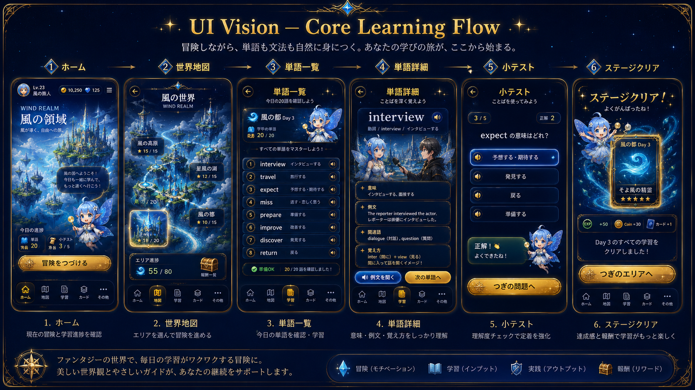

## Concept

Eigo Quest is not a flashcard app with a game skin — it is designed so that **daily English
study feels like progressing through an RPG world**:

```text
Learning   =  Power Up
Quiz       =  Battle
Cards      =  Hero Companions
Boss       =  Milestone Challenge
World Map  =  Main Progression
```

The core loop: **learn 20 words → clear the stage quiz → earn a hero card → unlock the next
stage.** Wrong answers are never punished — weak words simply come back for review, with warm,
encouraging feedback (「もう一度やってみよう」).

## The adventure · Home & World Map

Each child starts from their home base and explores **8 elemental worlds**
(Wind / Fire / Water / Thunder / Forest / Rock / Shadow / Light). A world is 10 stages of
20 words; mini bosses guard stages 4 and 8, and a world boss waits at stage 10 — boss battles
are quiz battles: correct answers strike the boss, wrong answers trigger a counterattack.

| Home — today's progress | World Map — pick your next stage |
|:---:|:---:|
| 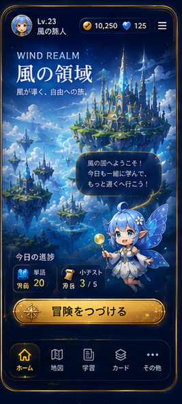 | 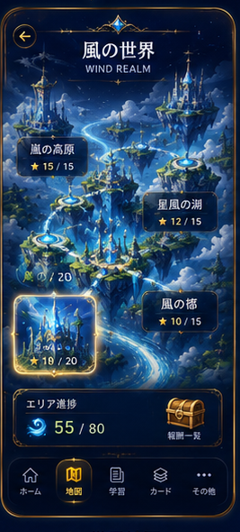 |

## 📚 Vocabulary Quest

Every day: **20 target words** with pronunciation, meaning, and example sentences → flashcard
study → a mini quiz → wrong answers are recorded and **come back first** in future sessions.

| Word list — today's 20 words | Word detail — meaning, examples, memory hooks |
|:---:|:---:|
| 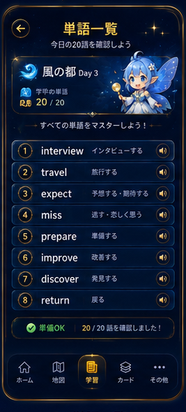 | 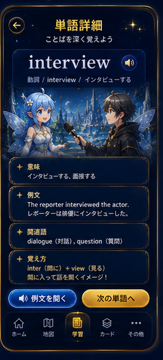 |

## ✏️ Grammar Quest

Grammar lessons (like the present perfect below) are taught with short explanations and example
sentences, then reinforced with grammar quizzes and form-practice drills. Mistakes always get
warm feedback — never punishment.

<p align="center">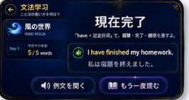</p>

## 🧠 Quiz & AI Practice

Stage quizzes check understanding after each unit, while **Google Gemini** powers the AI layer:
question generation matched to each child's level, **Eiken interview practice with on-the-spot
scoring**, and AI essay checking with advice.

<p align="center">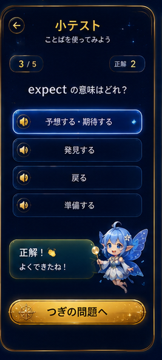</p>

## 🎓 Eiken (英検) preparation

- **Grade 3** vocabulary & phrase sets (bundled CSV datasets)
- **Grade Pre-2** practice sets, wrong-answer review, and a real-exam simulation mode
- Focused review of only the questions each child missed

## 🃏 Card rewards & progression

Clearing stages and defeating bosses awards **hero cards**; steady reviewing earns upgrade
materials, and Eiken challenges award badges. Every child profile keeps its own progress,
cards, and review queue — siblings never overwrite each other.

| Stage clear — rewards | Collect hero cards |
|:---:|:---:|
| 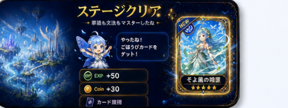 | 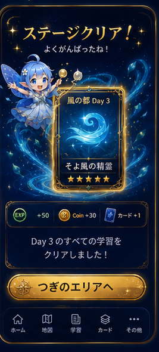 |

<p align="center">
  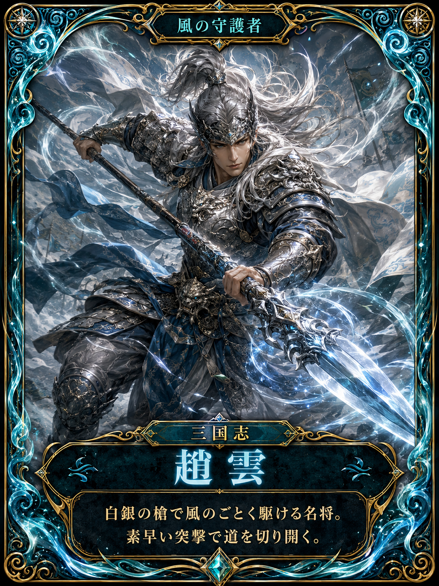
  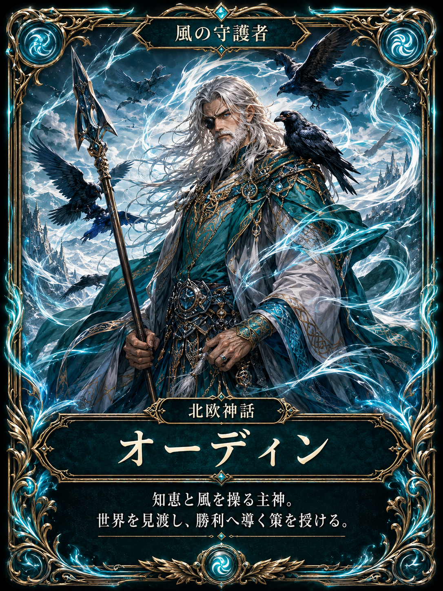
  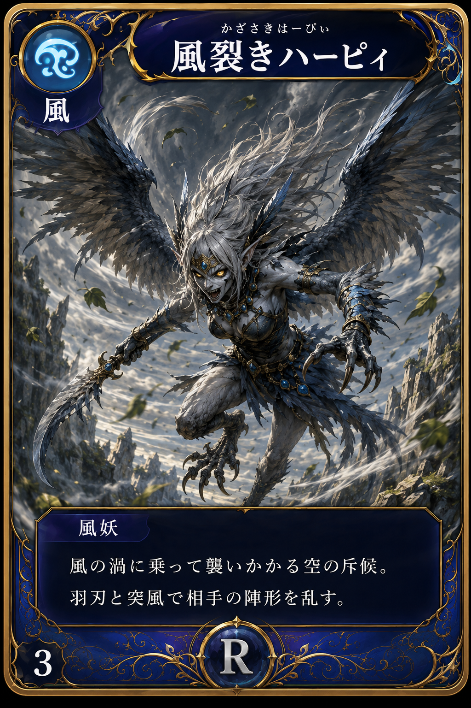
  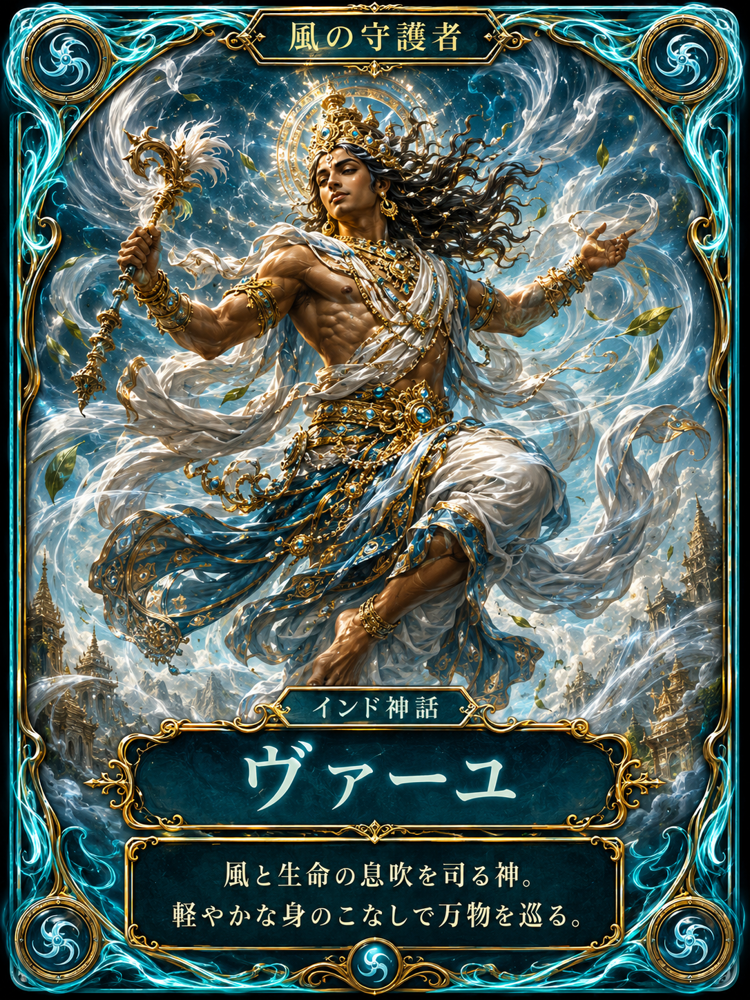
  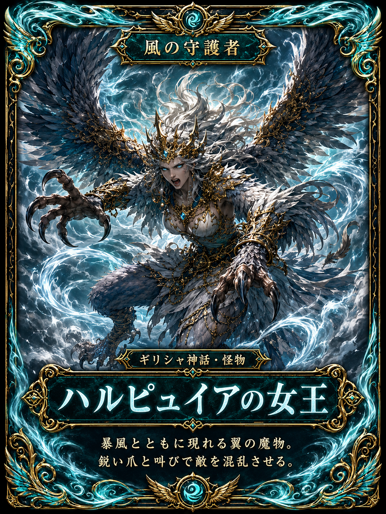
</p>

## 👨‍👩‍👧‍👦 Family friendly

Multiple child profiles with fully separate progress; parent dashboard and word manager;
mobile-first dark-fantasy UI with large touch targets and Japanese interface text.

## Tech stack

| Layer | Technology |
|---|---|
| Frontend | React + Vite + Tailwind CSS (mobile-first, `frontend/`) |
| Backend | Flask + gunicorn (`app.py`, REST APIs under `/api/*`) |
| Database | SQLite for local development · PostgreSQL (e.g. Neon/Render) in production |
| AI | Google Gemini via `google-genai` (question generation, interview scoring, essay check) |

## Getting started

**Backend** (Python 3.10+):

```bash
pip install -r requirements.txt
cp .env.example .env        # SQLite by default; set USE_POSTGRES/DATABASE_URL for Postgres
python app.py               # http://localhost:5000
```

**Frontend** (Node 18+):

```bash
cd frontend
npm install
npm run dev                 # http://localhost:5173
```

For production, build the frontend (`npm run build`) and let Flask serve the build, keeping
`/api/*` as backend routes.

## Project structure

```
├── app.py                  # Flask backend: children, progress, quizzes, rewards, Eiken, AI
├── frontend/               # React + Vite + Tailwind mobile app
│   └── src/pages/          # Home, StudyMap, BossBattle, Cards, Eiken, Grammar, Parent…
├── docs/                   # design docs, UI system, game loop — plus these images & slides
│   ├── images/             # README artwork & app screens
│   └── slides/             # project intro decks (EN / JA)
├── data/                   # learning content
├── eiken*.csv              # Eiken vocabulary & phrase datasets
└── AGENTS.md               # contributor / AI-agent working rules (start here!)
```

Design documents worth reading first: `docs/EIGO_QUEST_GAME_LOOP.md` (game design),
`docs/EIGO_UI_SYSTEM.md` (visual language), `docs/UI_COMPONENT_SYSTEM.md` (component rules).

## Design principles

- The backend database is the **single source of truth** for learning data
- Every child-specific API call carries a `childId` — progress never leaks between children
- Mistakes get warm feedback, never punishment
- *"A learning app that feels like an RPG, not a game that accidentally contains English questions."*

## License / usage

Personal family project for private use. Not affiliated with Eiken® or the Eiken Foundation of Japan.
